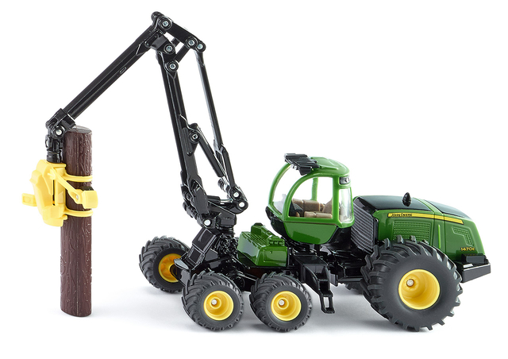

# Harvaster project

## Example of harvaster

## Initial tasks

- **Kamil Zawitaj**
  - Create a scene

- **Artsiom Kashkou**
  - Create classes and the structure of the project to be able to put some objects on a scene

- **Valery Burau**
  - Create a basic model of harvaster and put it on a scene
  
## Milestones

1. Create a scene with a cube. Enable camera movement.
2. Create a harvester object. Add basic lighting.
3. Animate harvester.
4. Upgrade graphics. Paint harvester, scene, add skybox. Add shaders.
